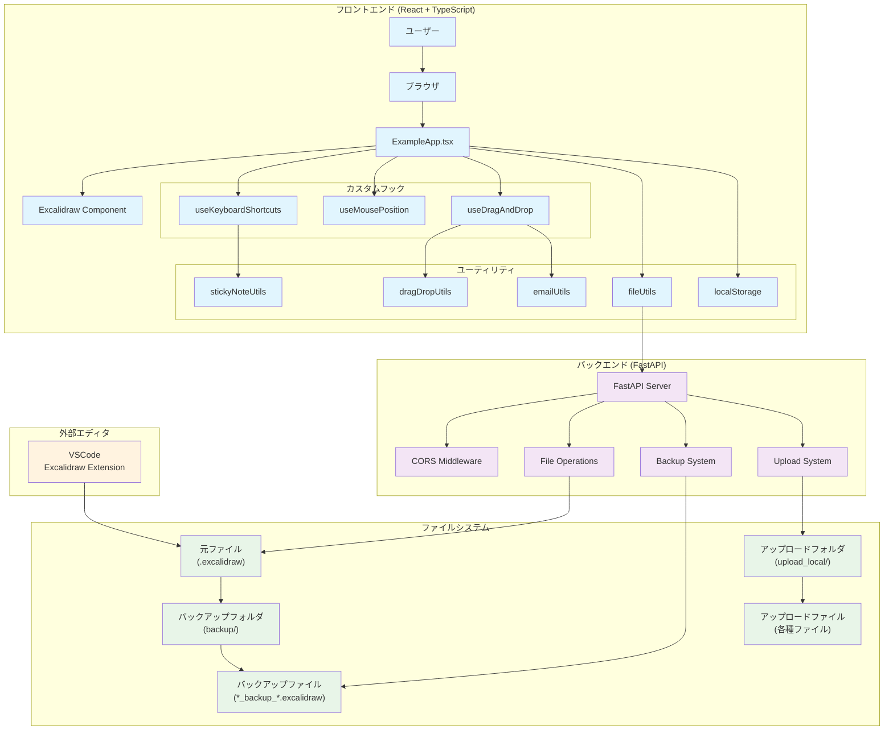
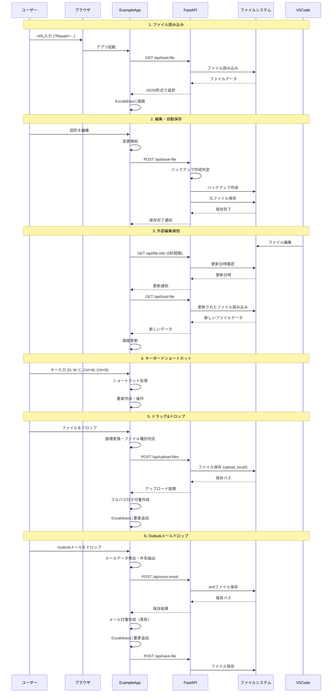
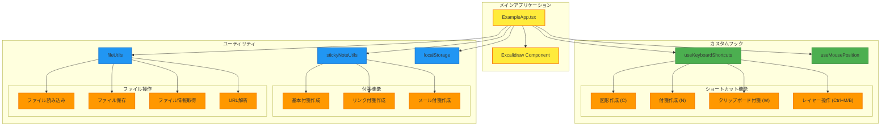
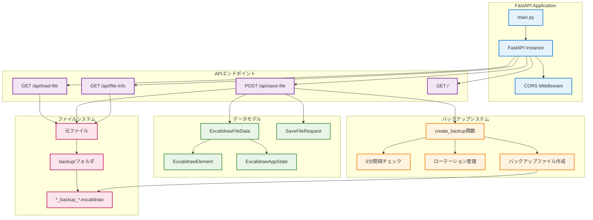
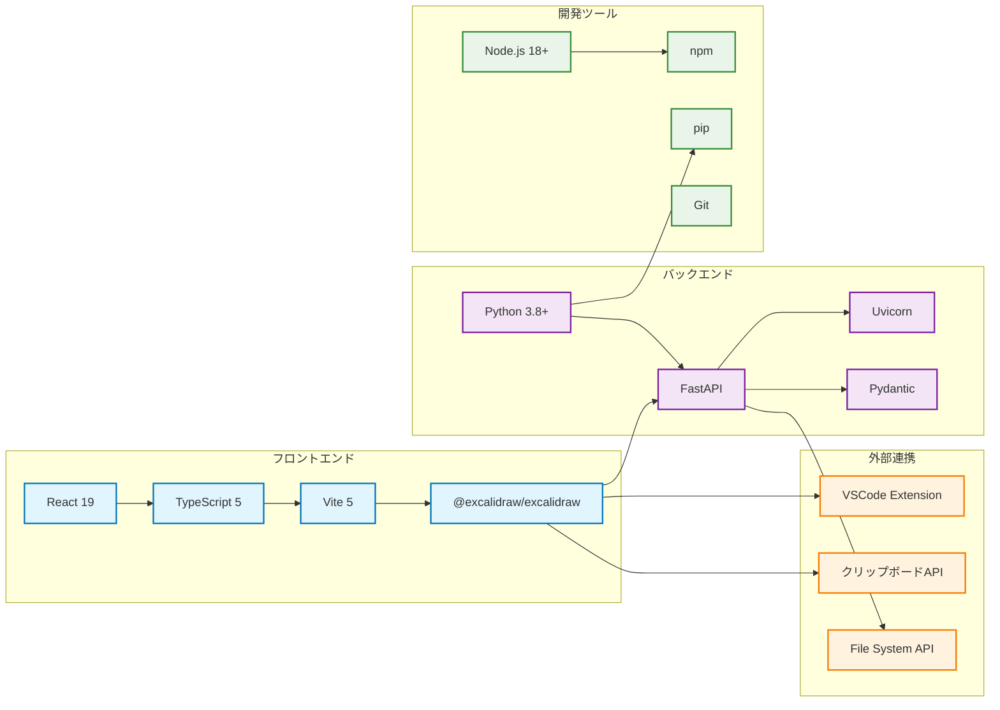

# システム構成図

## 全体構成

```mermaid
graph TB
    subgraph "フロントエンド (React + TypeScript)"
        A[ユーザー] --> B[ブラウザ]
        B --> C[ExampleApp.tsx]
        C --> D[Excalidraw Component]
        
        subgraph "カスタムフック"
            E[useKeyboardShortcuts]
            F[useMousePosition]
            G[useDragAndDrop]
        end
        
        subgraph "ユーティリティ"
            H[stickyNoteUtils]
            I[fileUtils]
            J[localStorage]
            K[dragDropUtils]
            L[emailUtils]
        end
        
        C --> E
        C --> F
        C --> G
        E --> H
        G --> K
        G --> L
        C --> I
        C --> J
    end
    
    subgraph "バックエンド (FastAPI)"
        M[FastAPI Server]
        N[CORS Middleware]
        O[File Operations]
        P[Backup System]
        Q[Upload System]
        
        M --> N
        M --> O
        M --> P
        M --> Q
    end
    
    subgraph "ファイルシステム"
        R["元ファイル<br/>(.excalidraw)"]
        S["バックアップフォルダ<br/>(backup/)"]
        T["バックアップファイル<br/>(*_backup_*.excalidraw)"]
        U["アップロードフォルダ<br/>(upload_local/)"]
        V["アップロードファイル<br/>(各種ファイル)"]
        
        R --> S
        S --> T
        U --> V
    end
    
    subgraph "外部エディタ"
        W["VSCode<br/>Excalidraw Extension"]
    end
    
    %% 接続関係
    I --> M
    O --> R
    P --> T
    Q --> U
    W --> R
    
    %% スタイル
    classDef frontend fill:#e1f5fe
    classDef backend fill:#f3e5f5
    classDef filesystem fill:#e8f5e8
    classDef external fill:#fff3e0
    
    class A,B,C,D,E,F,G,H,I,J,K,L frontend
    class M,N,O,P,Q backend
    class R,S,T,U,V filesystem
    class W external
```

## データフロー

```mermaid
sequenceDiagram
    participant User as ユーザー
    participant Browser as ブラウザ
    participant App as ExampleApp
    participant API as FastAPI
    participant FS as ファイルシステム
    participant VSCode as VSCode
    
    Note over User,VSCode: 1. ファイル読み込み
    User->>Browser: URL入力 (?filepath=...)
    Browser->>App: アプリ起動
    App->>API: GET /api/load-file
    API->>FS: ファイル読み込み
    FS-->>API: ファイルデータ
    API-->>App: JSON形式で返却
    App->>App: Excalidrawに描画
    
    Note over User,VSCode: 2. 編集・自動保存
    User->>App: 図形を編集
    App->>App: 変更検知
    App->>API: POST /api/save-file
    API->>API: バックアップ作成判定
    API->>FS: バックアップ作成
    API->>FS: 元ファイル保存
    FS-->>API: 保存完了
    API-->>App: 保存完了通知
    
    Note over User,VSCode: 3. 外部編集検知
    VSCode->>FS: ファイル編集
    App->>API: GET /api/file-info (5秒間隔)
    API->>FS: 更新日時確認
    FS-->>API: 更新日時
    API-->>App: 更新通知
    App->>API: GET /api/load-file
    API->>FS: 更新されたファイル読み込み
    FS-->>API: 新しいファイルデータ
    API-->>App: 新しいデータ
    App->>App: 画面更新
    
    Note over User,VSCode: 4. キーボードショートカット
    User->>App: キー入力 (N, W, C, Ctrl+M, Ctrl+B)
    App->>App: ショートカット処理
    App->>App: 要素作成・操作
    
    Note over User,VSCode: 5. ドラッグ&ドロップ
    User->>App: ファイルをドロップ
    App->>App: 座標変換・ファイル種別判定
    App->>API: POST /api/upload-files
    API->>FS: ファイル保存 (upload_local/)
    FS-->>API: 保存パス
    API-->>App: アップロード結果
    App->>App: フルパス付き付箋作成
    App->>App: Excalidrawに要素追加
    
    Note over User,VSCode: 6. Outlookメールドロップ
    User->>App: Outlookメールをドロップ
    App->>App: メールデータ検出・件名抽出
    App->>API: POST /api/save-email
    API->>FS: .emlファイル保存
    FS-->>API: 保存パス
    API-->>App: 保存結果
    App->>App: メール付箋作成（青色）
    App->>App: Excalidrawに要素追加
    App->>API: POST /api/save-file
    API->>FS: ファイル保存
```

## コンポーネント構成

```mermaid
graph TD
    subgraph "メインアプリケーション"
        A[ExampleApp.tsx]
        B[Excalidraw Component]
        A --> B
    end
    
    subgraph "カスタムフック"
        C[useKeyboardShortcuts]
        D[useMousePosition]
        
        subgraph "ショートカット機能"
            E["図形作成 (C)"]
            F["付箋作成 (N)"]
            G["クリップボード付箋 (W)"]
            H["レイヤー操作 (Ctrl+M/B)"]
        end
        
        C --> E
        C --> F
        C --> G
        C --> H
    end
    
    subgraph "ユーティリティ"
        I[stickyNoteUtils]
        J[fileUtils]
        K[localStorage]
        
        subgraph "付箋機能"
            L[基本付箋作成]
            M[リンク付箋作成]
            N[メール付箋作成]
        end
        
        subgraph "ファイル操作"
            O[ファイル読み込み]
            P[ファイル保存]
            Q[ファイル情報取得]
            R[URL解析]
        end
        
        I --> L
        I --> M
        I --> N
        J --> O
        J --> P
        J --> Q
        J --> R
    end
    
    A --> C
    A --> D
    A --> I
    A --> J
    A --> K
    
    %% スタイル
    classDef main fill:#ffeb3b,stroke:#f57f17,stroke-width:2px
    classDef hooks fill:#4caf50,stroke:#388e3c,stroke-width:2px
    classDef utils fill:#2196f3,stroke:#1976d2,stroke-width:2px
    classDef features fill:#ff9800,stroke:#f57c00,stroke-width:2px
    
    class A,B main
    class C,D hooks
    class I,J,K utils
    class E,F,G,H,L,M,N,O,P,Q,R features
```

## バックエンドAPI構成

```mermaid
graph TB
    subgraph "FastAPI Application"
        A[main.py]
        B[FastAPI Instance]
        C[CORS Middleware]
        
        A --> B
        B --> C
    end
    
    subgraph "APIエンドポイント"
        D[GET /api/load-file]
        E[POST /api/save-file]
        F[GET /api/file-info]
        G[GET /]
        
        B --> D
        B --> E
        B --> F
        B --> G
    end
    
    subgraph "データモデル"
        H[ExcalidrawFileData]
        I[SaveFileRequest]
        J[ExcalidrawElement]
        K[ExcalidrawAppState]
        
        E --> H
        E --> I
        H --> J
        H --> K
    end
    
    subgraph "バックアップシステム"
        L["create_backup関数"]
        M["5分間隔チェック"]
        N["ローテーション管理"]
        O["バックアップファイル作成"]
        
        L --> M
        L --> N
        L --> O
        E --> L
    end
    
    subgraph "ファイルシステム"
        P["元ファイル"]
        Q["backup/フォルダ"]
        R["*_backup_*.excalidraw"]
        
        P --> Q
        Q --> R
    end
    
    D --> P
    E --> P
    F --> P
    O --> R
    
    %% スタイル
    classDef api fill:#e3f2fd,stroke:#1976d2,stroke-width:2px
    classDef endpoint fill:#f3e5f5,stroke:#7b1fa2,stroke-width:2px
    classDef model fill:#e8f5e8,stroke:#388e3c,stroke-width:2px
    classDef backup fill:#fff3e0,stroke:#f57c00,stroke-width:2px
    classDef file fill:#fce4ec,stroke:#c2185b,stroke-width:2px
    
    class A,B,C api
    class D,E,F,G endpoint
    class H,I,J,K model
    class L,M,N,O backup
    class P,Q,R file
```

## 技術スタック

```mermaid
graph LR
    subgraph "フロントエンド"
        A["React 19"]
        B["TypeScript 5"]
        C["Vite 5"]
        D["@excalidraw/excalidraw"]
        
        A --> B
        B --> C
        C --> D
    end
    
    subgraph "バックエンド"
        E["Python 3.8+"]
        F["FastAPI"]
        G["Uvicorn"]
        H["Pydantic"]
        
        E --> F
        F --> G
        F --> H
    end
    
    subgraph "開発ツール"
        I["Node.js 18+"]
        J["npm"]
        K["pip"]
        L["Git"]
        
        I --> J
        E --> K
    end
    
    subgraph "外部連携"
        M["VSCode Extension"]
        N["クリップボードAPI"]
        O["File System API"]
        
        D --> N
        F --> O
        D --> M
    end
    
    %% 接続関係
    D --> F
    
    %% スタイル
    classDef frontend fill:#e1f5fe,stroke:#0277bd,stroke-width:2px
    classDef backend fill:#f3e5f5,stroke:#7b1fa2,stroke-width:2px
    classDef tools fill:#e8f5e8,stroke:#388e3c,stroke-width:2px
    classDef external fill:#fff3e0,stroke:#f57c00,stroke-width:2px
    
    class A,B,C,D frontend
    class E,F,G,H backend
    class I,J,K,L tools
    class M,N,O external
```

## ファイル構造

```mermaid
graph TD
    A[excalidraw_myao9494/]
    
    subgraph "フロントエンド"
        B[components/]
        C[hooks/]
        D[utils/]
        E[docs/]
        
        B --> B1[ExampleApp.tsx]
        C --> C1[useKeyboardShortcuts.ts]
        C --> C2[useMousePosition.ts]
        D --> D1[stickyNoteUtils.ts]
        D --> D2[fileUtils.ts]
        D --> D3[localStorage.ts]
        E --> E1[requirements.md]
        E --> E2[features.md]
        E --> E3[todo.md]
        E --> E4[architecture.md]
    end
    
    subgraph "バックエンド"
        F[backend/]
        F --> F1[main.py]
        F --> F2[requirements.txt]
        F --> F3[README.md]
    end
    
    subgraph "設定ファイル"
        G[package.json]
        H[tsconfig.json]
        I[vite.config.ts]
        J[README.md]
    end
    
    A --> B
    A --> C
    A --> D
    A --> E
    A --> F
    A --> G
    A --> H
    A --> I
    A --> J
    
    %% スタイル
    classDef root fill:#ffeb3b,stroke:#f57f17,stroke-width:3px
    classDef frontend fill:#e1f5fe,stroke:#0277bd,stroke-width:2px
    classDef backend fill:#f3e5f5,stroke:#7b1fa2,stroke-width:2px
    classDef config fill:#e8f5e8,stroke:#388e3c,stroke-width:2px
    classDef file fill:#f5f5f5,stroke:#616161,stroke-width:1px
    
    class A root
    class B,C,D,E,B1,C1,C2,D1,D2,D3,E1,E2,E3,E4 frontend
    class F,F1,F2,F3 backend
    class G,H,I,J config
```